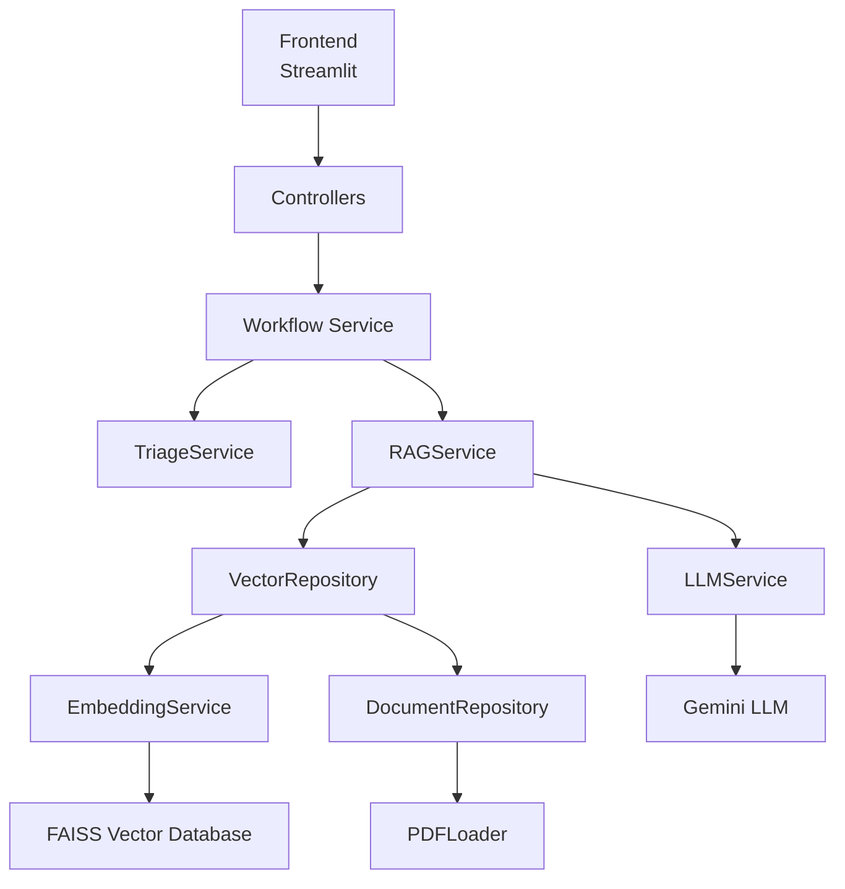
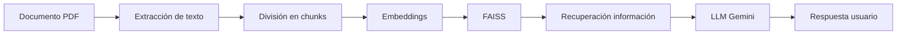

# 🤖 JuntosIA - Agente Inteligente basado en RAG
## 📌 Descripción del proyecto
**JuntosIA** es un agente de inteligencia artificial diseñado para asistir en la consulta de información relacionada con los **procedimientos administrativos del Programa Nacional de Apoyo Directo a los Más Pobres - Juntos**.
El objetivo principal del sistema es permitir que los usuarios realicen preguntas en lenguaje natural sobre documentos normativos, procedimientos internos, manuales y documentación administrativa, obteniendo respuestas fundamentadas en la información contenida en los documentos oficiales.
El agente utiliza una arquitectura **RAG (Retrieval Augmented Generation)**, permitiendo combinar modelos de lenguaje avanzados con una base de conocimiento documental propia.
---
# 🎯 Objetivo de JuntosIA
El objetivo del agente es:
- Facilitar la consulta de procedimientos administrativos.
- Reducir el tiempo de búsqueda de información en documentos extensos.
- Brindar respuestas contextualizadas basadas en documentación oficial.
- Mostrar las fuentes utilizadas para generar cada respuesta.
- Mejorar la accesibilidad al conocimiento institucional.
---
# 💡 ¿Qué problema resuelve?
Los procedimientos administrativos suelen encontrarse distribuidos en documentos PDF extensos.
La búsqueda tradicional requiere:
1. Abrir diferentes documentos.
2. Buscar manualmente términos específicos.
3. Revisar páginas completas.
4. Interpretar la información encontrada.

JuntosIA automatiza este proceso mediante inteligencia artificial:
````
Usuario
   |
Pregunta en lenguaje natural
   |
JuntosIA
   |
Busca información relevante
   |
Genera respuesta basada en documentos
```
---
# 🚀 Capacidades principales
JuntosIA permite:
✅ Consultar procedimientos administrativos mediante preguntas.
Ejemplo:
> ¿Qué es un miembro objetivo?
Respuesta:
> Según el procedimiento institucional, un miembro objetivo corresponde a...

---
✅ Recuperar información desde documentos PDF.
✅ Realizar búsqueda semántica, no solamente búsqueda por palabras.
✅ Entregar referencias documentales:
- Archivo utilizado.
- Página del documento.
- Fragmento empleado como evidencia.
✅ Clasificar consultas mediante un módulo de triaje.

---
# 🧠 Arquitectura del sistema
JuntosIA utiliza una arquitectura:
- MVC
- Service Layer
- Repository Pattern
- Dependency Injection
- Factory Pattern
Arquitectura general:


---
# 🔎 Funcionamiento del RAG
El funcionamiento interno:

---
# 🛠️ Tecnologías utilizadas
## Backend
- Python
- Arquitectura MVC
- Pydantic
- Dependency Injection

## Inteligencia Artificial
### Modelo LLM
Google Gemini
Responsable de:
- Comprensión de preguntas.
- Generación de respuestas.
- Uso del contexto recuperado.
---
### Modelo de Embeddings
BAAI/bge-m3
Responsable de:
- Transformar documentos en vectores.
- Realizar búsqueda semántica.
---
## Framework IA
### LangChain
Utilizado para:
- Gestión de documentos.
- Embeddings.
- Vector stores.
- Retrieval.
---
## Base vectorial
### FAISS
Utilizado para:
- Almacenar embeddings.
- Buscar fragmentos relevantes.
---
## Frontend
### Streamlit
Utilizado para:
- Interfaz conversacional.
- Interacción usuario-agente.
---
# ⚙️ Instalación
## Requisitos previos
Se requiere:
- Python 3.12 o superior.
- Git.
- Cuenta con acceso a API de Google Gemini.
---
# 1. Clonar repositorio
```bash
git clone URL_DEL_REPOSITORIO
cd AgenteJuntosIA
```
---
# 2. Crear entorno virtual
Linux / Mac:
```bash
python -m venv .venv
source .venv/bin/activate
```
Windows:
```bash
python -m venv .venv
.venv\Scripts\activate
```
---
# 3. Instalar dependencias
Ejecutar:
```bash
pip install -r requirements.txt
```
---
# 4. Configurar variables de entorno
Crear un archivo:
```
.env
```
Agregar:
```env
GEMINI_API_KEY=TU_API_KEY
GEMINI_MODEL=gemini-3.1-flash-lite
EMBEDDING_MODEL=BAAI/bge-m3
```
---
# 5. Agregar documentos
Los documentos utilizados como fuente de conocimiento deben colocarse en:
```
data/documents/
```
Ejemplo:
```
data/
└── documents/
    ├── procedimiento_01.pdf
    ├── procedimiento_02.pdf
```
---
# 6. Crear la base vectorial
Al iniciar por primera vez, JuntosIA:
1. Lee los documentos PDF.
2. Extrae el texto.
3. Divide la información en fragmentos.
4. Genera embeddings.
5. Construye el índice FAISS.
Resultado:
```
vectorstore/
├── index.faiss
└── index.pkl
```
---

# ▶️ Ejecución
Ejecutar:
```bash
streamlit run frondend/app.py
```
La aplicación estará disponible en:
```
http://localhost:8501
```
---
# 📂 Estructura principal
```
AgenteJuntosIA
├── backend
├── data
│   └── documents
├── vectorstore
├── frondend
├── requirements.txt
└── main.py
```
---
# 🔐 Seguridad y buenas prácticas
- Las claves API se manejan mediante variables de entorno.
- Los documentos permanecen dentro de la infraestructura local.
- La información recuperada se utiliza como contexto del modelo.
- Las respuestas incluyen evidencia documental.
---
# 🚧 Próximas mejoras
- Memoria conversacional.
- Autenticación de usuarios.
- Evaluación automática de respuestas RAG.
- Re-ranking de documentos.
- Dashboard de consultas.
- Despliegue mediante Docker.
- Integración con servicios institucionales.
---
# 👨‍💻 Proyecto
**JuntosIA**
Agente inteligente para consulta de procedimientos administrativos utilizando Retrieval Augmented Generation (RAG).

